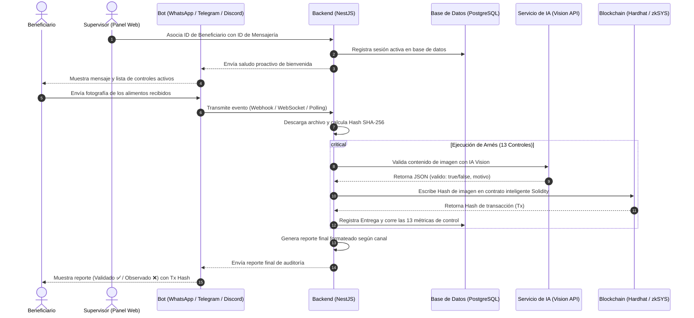

# 🤖 Manual de Funcionamiento de Bots (WhatsApp, Telegram y Discord)

**VasoChain AI — Sistema de Integración Conversacional y Procesamiento de Entregas**

---

## 🗺️ 1. Flujo de Trabajo General (Pipeline Conversacional)

El sistema de mensajería de **VasoChain AI** asocia la identidad física de un beneficiario con su identificador de mensajería digital (número de teléfono, Chat ID o User ID) para permitirle reportar su recepción de alimentos enviando una simple fotografía.



---

## 🛠️ 2. ¿Cómo funciona cada Canal? (Detalle Técnico)

### 🟢 A. WhatsApp (Integración vía Whapi.Cloud)
* **Mecanismo:** Basado en Webhooks tradicionales.
* **Flujo:**
  1. El usuario envía un mensaje a WhatsApp.
  2. La API de Whapi.Cloud recibe el mensaje y envía una petición `POST` al endpoint `/whatsapp/webhook` del backend.
  3. El backend valida la firma del token `WHAPI_TOKEN`.
  4. Identifica al beneficiario mediante el número de celular del remitente (`from`).
  5. Si el mensaje contiene un adjunto (imagen), descarga el archivo temporal utilizando la API de Whapi y ejecuta el pipeline.
* **Formato Estético:** Envía negrita usando el delimitador asterisco (`*negrita*`) e itálica usando guion bajo (`_italica_`).

### 🔵 B. Telegram (Integración vía Long Polling)
* **Mecanismo:** Bucle asíncrono y autónomo de **Long Polling** (`getUpdates`).
* **Flujo:**
  1. Al iniciar la aplicación, `TelegramService` abre un ciclo de consulta continuo mediante peticiones HTTP repetitivas al servidor de Telegram.
  2. Al no depender de webhooks entrantes, **no requiere exponer puertos públicos ni configurar túneles NGROK**, lo que facilita el desarrollo local.
  3. Si el bot recibe un mensaje de texto que no está asociado a una sesión, le responde con un `/start` automático que revela su **Telegram Chat ID** personal (ej: `873629064`).
  4. Cuando se asocia el Chat ID y el usuario envía una imagen, el backend utiliza el `file_id` de Telegram para consultar su ruta de descarga y procesar el buffer.
* **Formato Estético:** Utiliza marcas **HTML nativas de Telegram** (`<b>` para negritas, `<i>` para cursiva y `<code>` para hashes blockchain).

### 🟣 C. Discord (Integración vía Websocket Gateway)
* **Mecanismo:** Conexión persistente por WebSocket a través del paquete `discord.js`.
* **Flujo:**
  1. El bot se conecta a la red de Discord al arrancar el backend (`DISCORD_BOT_TOKEN`).
  2. Escucha de manera permanente en el evento `messageCreate`.
  3. Filtra y procesa únicamente los mensajes que se envían por **Mensaje Directo (DM / Canal Privado)** al bot, ignorando los chats de servidores públicos para mantener la privacidad.
  4. Descarga la imagen adjunta a través de la URL de CDN de Discord y la envía al pipeline.
* **Formato Estético:** Utiliza la sintaxis estándar de **Markdown de Discord** (`**negrita**`, `*cursiva*` y bloques de código con acento grave `` `hash` ``).

---

## 🧠 3. Flujo Guiado Interactivo y Máquina de Estados

Para ofrecer una experiencia inclusiva y amigable a las beneficiarias del programa, los bots de **VasoChain AI** no son simples respondedores planos, sino que implementan una **máquina de estados conversacional** (`EstadoBot`). Esto permite guiar paso a paso a la persona en su propio idioma y verificar su identidad de forma segura.

### 🔄 Los Estados de la Conversación
Cada usuario mantiene una sesión temporal en memoria (`SesionUsuario` en `BotStateService`) con los siguientes estados:

| Estado | Acción del Bot / Pantalla | Entrada Esperada del Usuario | Transición Siguiente |
| :--- | :--- | :--- | :--- |
| **`INICIO`** | Se activa al recibir el primer mensaje o comando `/start`. | Ninguna (automática). | `ELEGIR_IDIOMA` |
| **`ELEGIR_IDIOMA`** | Muestra el menú interactivo con botones de selección de idioma. | Clic en: 🇵🇪 Español, 🌽 Quechua, o 🏔️ Aimara. | `IDENTIFICARSE` |
| **`IDENTIFICARSE`** | Solicita al usuario elegir cómo desea autenticarse. | Clic en: 📷 Foto del QR, o ✍️ Escribir DNI. | `ESPERANDO_DNI` (u escaneo) |
| **`ESPERANDO_DNI`** | Espera el envío del DNI en texto o una foto del código QR. | Envía texto (8 números) o foto nítida del QR. | `ESPERANDO_FOTO` (si es válido) |
| **`ESPERANDO_FOTO`** | Confirma identidad y pide capturar los alimentos recibidos. | Envía la fotografía de evidencia física. | `PROCESANDO` |
| **`PROCESANDO`** | Bloquea la conversación mientras ejecuta el análisis de IA y firma. | Ninguna (procesamiento interno). | `FINALIZADO` |
| **`FINALIZADO`** | Presenta el reporte de auditoría e inmutabilidad en Blockchain. | Clic en: 🔄 Nueva entrega, o 🆕 Reiniciar. | `ESPERANDO_FOTO` o `INICIO` |

---

### 🌐 3.1. Inclusión Social: Selección de Idioma
El bot soporta tres lenguas oficiales del Perú:
1. **Español (es)**: Flujo de interacción estándar en castellano.
2. **Quechua (qu)**: Mensajes adaptados culturalmente al quechua.
3. **Aimara (ay)**: Traducciones adaptadas al aimara.

Las plantillas de texto están centralizadas en `bot-i18n.ts` bajo la función `obtenerTextos(idioma)`.

---

### 💳 3.2. Identificación Inteligente (DNI o QR)
Una vez elegido el idioma, el bot le ofrece dos alternativas para validarse contra el padrón de beneficiarios:
* **Opción DNI (✍️ Escribir DNI):** El bot le pide que digite su número. El backend valida en la base de datos de PostgreSQL que el DNI corresponda a un registro del padrón. Si coincide, vincula su chat (Telegram o Discord) con ese beneficiario.
* **Opción QR (📷 Foto del QR):** El usuario puede tomarle una foto a su tarjeta del programa social que contiene un código QR. El backend usa un lector de códigos ópticos (`qr-reader.ts` basado en JSQR) que procesa el buffer de la foto recibida, extrae la URL del QR, obtiene el identificador de la beneficiaria y la autentica automáticamente.

Una vez validada, el bot avanza a **`ESPERANDO_FOTO`**, donde la beneficiaria ya puede enviar la foto del plato o alimentos para registrar su entrega de forma segura en la blockchain.

---

## ⚙️ 4. Guía de Configuración e Inicio

Para habilitar y probar cualquiera de los tres bots:

### Paso 1: Configurar credenciales en el archivo `.env`
Pega los tokens correspondientes en la raíz de tu proyecto:
```env
WHAPI_TOKEN=tu_token_de_whatsapp
TELEGRAM_BOT_TOKEN=tu_token_de_telegram_generado_por_botfather
DISCORD_BOT_TOKEN=tu_token_de_discord_creado_en_developer_portal
```

### Paso 2: Iniciar sesión conversacional
1. Abre el panel web del simulador en [http://localhost:5174/simulador](http://localhost:5174/simulador).
2. Elige el canal deseado en el selector de iconos superior.
3. Selecciona una beneficiaria del padrón.
4. Escribe tu ID real (Chat ID de Telegram o User ID de Discord) en la sección **Plan B**.
5. Haz clic en **Asociar Sesión Real**.
6. Recibirás un saludo de bienvenida automático en tu celular. Responde enviándole la foto de evidencia.

---

## 📊 5. Estructura del Reporte de 13 Controles (Mensaje del Bot)

El bot finaliza el flujo enviando un reporte jerárquico estructurado en 5 niveles:

```text
✅ Entrega Validada Exitosamente

¡Excelente, Maria Gomez! Buenas tardes 🌤️.
La evidencia de alimentos ha sido procesada y aprobada por nuestro arnés de seguridad.

📊 REPORTE DE VALIDADORES (13 Controles de Arnés):
--------------------------------------------------
Nivel 1: Entrada y Registro 📝
• ✅ [HC-001] Validación QR: PASÓ (3ms)
• ✅ [HC-002] Geolocalización: PASÓ (0ms)
• ✅ [HC-003] Rango Horario: PASÓ (0ms)

Nivel 2: Evidencia Fotográfica 📸
• ✅ [HC-004] Reconocimiento por IA: PASÓ (1240ms)
• ✅ [HC-005] Integridad EXIF: PASÓ (0ms)
• ✅ [HC-006] Detección de Rostro: PASÓ (0ms)

Nivel 3: Consistencia de Datos 📋
• ✅ [HC-007] Consistencia Padrón: PASÓ (2ms)
• ✅ [HC-008] Frecuencia 24h: PASÓ (4ms)
• ✅ [HC-009] QR Vigente: PASÓ (1ms)

Nivel 4: Integridad Blockchain ⛓️
• ✅ [HC-010] Sello en Cadena: PASÓ (2ms)
• ✅ [HC-011] Confirmación de Bloque: PASÓ (0ms)

Nivel 5: Supervisión y Auditoría 🚨
• ✅ [HC-012] Emisión de Alertas: PASÓ (0ms)
• ✅ [HC-013] Muestreo Aleatorio: PASÓ (0ms)
--------------------------------------------------

🔗 REGISTRO INMUTABLE EN CADENA:
• Estado: VALIDADA 🟢
• Hash Evidencia: d41d8cd98f00b204e9800998ecf8427e
• Transacción Blockchain (Tx): 0x6831481c9617ea75ad6b86d2bd244b5f4df...
```
